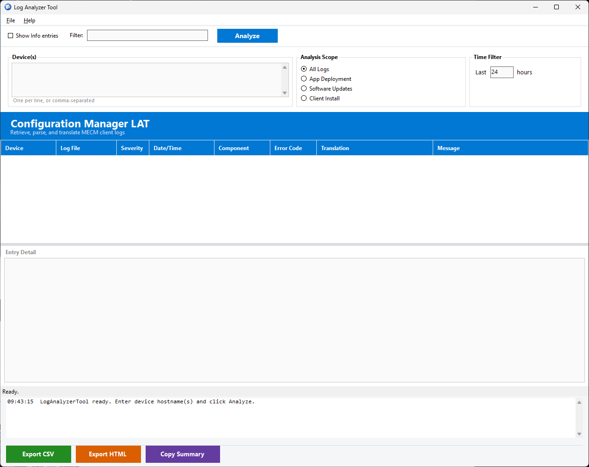

# Log Analyzer Tool (LAT)

A WinForms-based PowerShell GUI for analyzing MECM (Configuration Manager) client logs from remote devices. Retrieves logs via ADMIN$ share, parses CMTrace-format files, translates 100+ error codes to plain English, detects root causes, and exports results to CSV or HTML.



## Requirements

- Windows 10/11
- PowerShell 5.1
- .NET Framework 4.8+
- ADMIN$ share access to target devices

## Quick Start

```powershell
powershell -ExecutionPolicy Bypass -File start-loganalyzer.ps1
```

## Features

### Log Retrieval & Parsing

- Retrieves logs from remote devices via ADMIN$ share (network access only on Analyze)
- Parses both XML-style CMTrace and legacy CMTrace log formats
- Supports 14 distinct MECM log files across 3 analysis areas
- Handles multi-line messages and rotated `.lo_` log files
- Time-based filtering (last N hours)

### Analysis Engines

| Engine | Logs Analyzed | Detects |
|--------|--------------|---------|
| **App Deployment** | AppEnforce, AppDiscovery, CAS, ContentTransferManager, LocationServices | Install/uninstall failures, detection mismatches, content access issues |
| **Software Updates** | WUAHandler, UpdatesDeployment, UpdatesHandler, UpdatesStore | Scan failures, deployment issues, WSUS connectivity |
| **Client Install** | ccmsetup, client.msi, MicrosoftPolicyPlatformSetup.msi | 3010 reboot masking, firewall blocks, DNS failures, domain issues, MPP corruption |

### Error Code Translation

Over 100 error codes across 6 databases:

- **MECM** &mdash; CM-specific HRESULT codes (0x87D0xxxx)
- **Windows** &mdash; Win32 HRESULT codes (E_FAIL, FILE_NOT_FOUND, RPC errors)
- **Windows Update Agent** &mdash; WUA scan and deployment codes
- **BITS** &mdash; Background transfer service errors
- **CCMSetup** &mdash; Client setup-specific codes
- **MSI** &mdash; Windows Installer error codes

Each entry includes the error message, a resolution suggestion, and recommended logs to check.

### Root Cause Detection

- **Firewall/Port Block** &mdash; Tests 5 MECM ports (80, 443, 10123, 8530, 8531) via async TCP
- **DNS Resolution** &mdash; Validates device hostname resolves in DNS
- **Domain Join** &mdash; Verifies machine is domain-joined via WMI
- **MPP Corruption** &mdash; Scans for MOF compile failures in Microsoft Policy Platform setup

### 3010 Reboot Masking Detection

Compares the MSI exit timestamp against the last system reboot time (CIM with WMI fallback) to determine whether a pending 3010 reboot has been satisfied.

### Export & Reporting

- **CSV** &mdash; Full results with all columns, saved to `Reports/`
- **HTML** &mdash; Self-contained styled report with color-coded severity, root cause alerts, and recommendations
- **Copy Summary** &mdash; Plain-text summary copied to clipboard, ready for email or tickets

### UI

- Dark mode and light mode with full theme support
  - Custom ToolStrip renderer (no light borders/gradients in dark mode)
  - Themed input borders, grid selection highlights, and separator lines
  - Flat-styled GroupBoxes, RadioButtons, and CheckBoxes
- Real-time text filter across message, error code, translation, and component
- Toggle Info-level entries on/off
- Color-coded severity rows (red = error, orange = warning)
- Detail panel (RichTextBox) with full entry context, translation, resolution, and recommended logs
- Live log console showing analysis progress
- Window position, size, and splitter distance persistence across sessions
- All logs filtered to warnings and errors at parse time for fast grid loading

## Project Structure

```
loganalyzer/
  start-loganalyzer.ps1          Main WinForms application
  Module/
    LogAnalyzerCommon.psd1       Module manifest (v1.0.0)
    LogAnalyzerCommon.psm1       Core module (parsing, analysis, export)
  ErrorCodes/
    mecm-errors.json             26 MECM error codes
    windows-errors.json          30 Windows HRESULT codes
    wua-errors.json              27 Windows Update Agent codes
    bits-errors.json             BITS transfer errors
    ccmsetup-errors.json         CCM setup errors
    msi-errors.json              MSI installer errors
  Logs/                          Session logs (auto-created)
  Reports/                       Exported reports
```

## Preferences

Stored in `LogAnalyzer.prefs.json`. Accessible via File > Preferences.

| Setting | Description |
|---------|-------------|
| DarkMode | Toggle dark/light theme (requires restart) |

## License

This project is licensed under the [GNU General Public License v3.0](LICENSE).

## Author

Jason Ulbright
