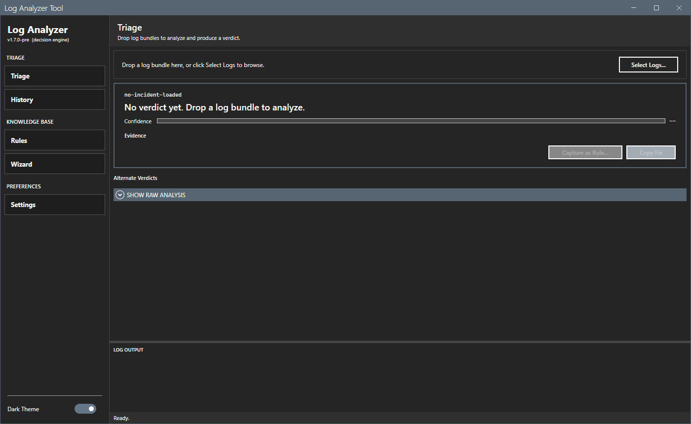

# Log Analyzer Tool

A rule-driven triage tool for MECM (Configuration Manager) client
logs.  Drop a log file, get a plain-English verdict, three lines of
evidence, and a suggested fix.  Authors keep the rulebase growing by
capturing new triages as reusable rules.

**Built for MECM engineers and admins who already know which log to
pull.**  A helpdesk-facing consumption UI (hostname + symptom, no
log-file knowledge required) is a separate future product; see the
"Roadmap note" below.



## Requirements

- Windows 10 / 11 (or Windows Server)
- PowerShell 5.1, STA
- No external dependencies.  MahApps, ControlzEx, and
  Xaml.Behaviors ship vendored in `Lib/`.

## Quick start

Download the latest release zip from
[Releases](https://github.com/jasonulbright/log-analyzer-tool/releases),
extract, and run:

```powershell
powershell.exe -NoProfile -ExecutionPolicy Bypass -File .\start-loganalyzer-wpf.ps1
```

The shell opens in Dark theme.  Click **Triage**, then **Select
Logs...**, then pick one or more MECM client log files.  A verdict
card appears with the top rule, alternate verdicts, evidence, and
fix.  Click **Copy Fix** to put the fix text on your clipboard.
Click **Capture as Rule...** to open the authoring wizard and add a
new rule to your local overlay.

## Sidebar modules

- **Triage** (default).  Drop logs, get a verdict.  Also writes an
  incident bundle under `%LOCALAPPDATA%\LogAnalyzer\incidents\` for
  replay later.
- **History.**  List of stored incidents.  Select one and click
  Re-analyze to replay it against the current rulebase.  Diff pane
  shows which rules added / removed / retained since the original
  triage.  Useful after editing rules to see what they would have
  fired against.
- **Rules.**  Read-only browser over the loaded rulebase (SYSTEM
  baseline + USER overlay).  Filter by scope, source, or free-text
  search over id / verdict.  Click a rule to read its full schema,
  conditions, evidence, and fix.
- **Wizard.**  Standalone wizard entry point.  Pick any stored
  incident from the dropdown and launch the authoring dialog
  against it.
- **Settings.**  Paths (baseline + overlay + incidents), current
  rule counts split SYSTEM / USER, and one-click Reload / Trim /
  Open-folder actions.  Retention cap is 50 incidents, FIFO.

## Rulebase layout

- **SYSTEM** rules (shipped baseline) live under `Rules/Baseline/<scope>/`
  where scope is `App`, `SoftwareUpdate`, `ClientInstall`, or
  `CrossScope`.  The initial baseline ships ~100 rules.
- **USER** rules (your local overlay) live under
  `%LOCALAPPDATA%\LogAnalyzer\rules\`.  Rules you author via the
  wizard land here.  USER rules override SYSTEM rules with the
  same id.
- The wizard's **Export patch** button emits a git-applicable
  unified diff under `c:\temp\` for upstream contribution back
  to this repo.

## What the wizard produces

Every Save writes a schema-valid JSON rule to your overlay.  The
Export patch button produces a diff targeting
`Rules/Baseline/<scope>/<id>.json` so you can submit the rule
upstream via a pull request.

Save and Export patch are both non-terminal -- the dialog stays
open so you can iterate on the draft, save a checkpoint, export a
patch on the same draft, and close when done.

## Live MECM client logs (SMB)

Reads open files the SMS Agent Host is actively writing to, via
`FileShare.ReadWrite`.  Point the file picker at
`\\<hostname>\c$\Windows\CCM\Logs\` and the triage runs without
"used by another process" errors.

## Roadmap note

This tool is the MECM-engineer-focused rule authoring and log
triage shell.  A companion tool for helpdesk consumption -- hostname
+ symptom entry, automated log retrieval, markdown-rendered fix
with inline images, one-click ticket output -- is planned as a
separate product with a web-stack UI.  The rulebase in this repo
is intended to be the content source for both tools.

## License

[MIT](LICENSE).

## Author

Jason Ulbright (github.com/jasonulbright)
